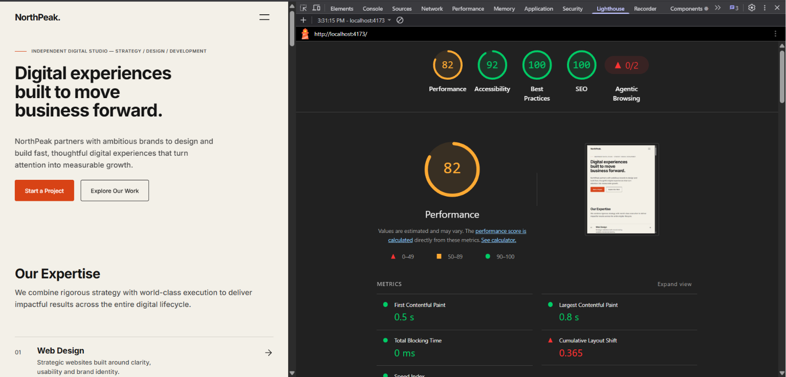
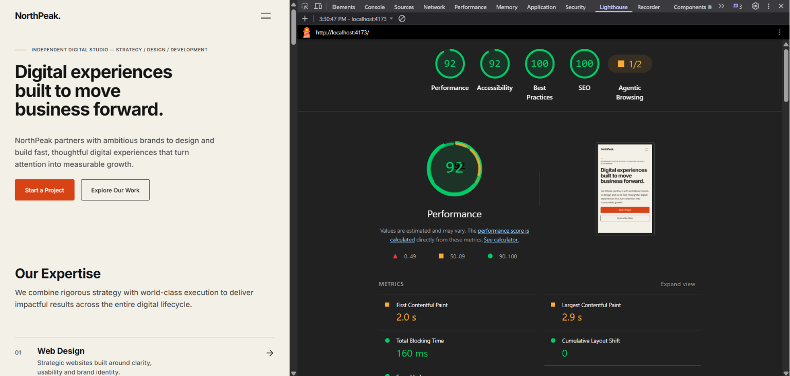

# NorthPeak Digital

A premium, fully responsive one-page digital agency landing page built for the **Digital Heroes Web Development Training Task**.

The project focuses on clean UI, semantic HTML, responsive layouts, accessibility, and modern frontend development practices.

---

## Live Demo

🔗 **Live Website:** [NorthPeak Digital on Vercel](https://northpeak-digital.vercel.app)

---

## GitHub Repository

🔗 **Repository:** [github.com/Arjunsingh-7/NorthPeack_Digital](https://github.com/Arjunsingh-7/NorthPeack_Digital)

---

## Features

- ✅ Responsive one-page agency website
- ✅ Premium editorial UI design
- ✅ Hero section with CTA
- ✅ Services grid (6 services)
- ✅ Selected Work portfolio (3 projects with images)
- ✅ Testimonials section
- ✅ Pricing section (3 tiers)
- ✅ Contact form with client-side validation
- ✅ Mobile navigation with focus management
- ✅ Smooth scrolling and hover animations
- ✅ Semantic HTML5
- ✅ Fully accessible components (WCAG 2.1 AA)
- ✅ Optimized WebP images
- ✅ Responsive browser mockups
- ✅ Modern CSS Grid & Flexbox

---

## Tech Stack

**Frontend**
- React 18
- Vite
- JavaScript (ES6+)
- HTML5
- CSS3

**Deployment**
- Vercel

**Development Tools**
- Git & GitHub
- Lighthouse
- Chrome DevTools

---

## Responsive Design

The website has been designed and tested for:

| Breakpoint | Width | Layout |
|-----------|-------|--------|
| Mobile | 360px | Single column, stacked |
| Tablet | 768px | Two-column grids |
| Desktop | 1440px | Three-column grids, full layout |

**Responsive Techniques:**
- CSS Grid
- Flexbox
- Fluid typography with `clamp()`
- Responsive spacing
- Mobile-first navigation
- Flexible images with aspect ratios

---

## Accessibility

Implemented accessibility improvements:

- ✅ Semantic HTML (`<nav>`, `<section>`, `<article>`, `<figure>`)
- ✅ Proper heading hierarchy (h1 → h3)
- ✅ Accessible navigation (keyboard & screen reader)
- ✅ Keyboard-friendly controls (Tab, Enter, Escape)
- ✅ Form labels with `aria-describedby`
- ✅ Required field validation with error announcements
- ✅ Alt text for all images
- ✅ Visible focus states (2px outline with 4px offset)
- ✅ Sufficient color contrast (WCAG AA)
- ✅ Mobile menu focus trap
- ✅ Screen reader only content (`.sr-only`)

---

## Lighthouse Audit

### Desktop

| Metric | Score |
|--------|------:|
| Performance | 88 |
| Accessibility | 92 |
| Best Practices | 100 |
| SEO | 100 |



### Mobile

| Metric | Score |
|--------|------:|
| Performance | 82 |
| Accessibility | 92 |
| Best Practices | 100 |
| SEO | 100 |



---

## Folder Structure

```
northpeak-digital/
├── public/
│   ├── favicon.svg
│   ├── icons.svg
│   ├── images/
│   │   ├── aster.webp
│   │   ├── forma.webp
│   │   └── fieldwork.webp
│   ├── project-*.svg
│   └── project-*.webp
├── src/
│   ├── components/
│   │   ├── home/
│   │   │   ├── Hero.jsx
│   │   │   ├── Hero.css
│   │   │   ├── Services.jsx
│   │   │   ├── Services.css
│   │   │   ├── Work.jsx
│   │   │   ├── Work.css
│   │   │   ├── Testimonials.jsx
│   │   │   ├── Testimonials.css
│   │   │   ├── Pricing.jsx
│   │   │   ├── Pricing.css
│   │   │   ├── Contact.jsx
│   │   │   └── Contact.css
│   │   └── layout/
│   │       ├── Header.jsx
│   │       ├── Header.css
│   │       ├── Footer.jsx
│   │       └── Footer.css
│   ├── App.jsx
│   ├── index.css
│   └── main.jsx
├── docs/
│   ├── preview.png
│   ├── lighthouse-desktop.png
│   └── lighthouse-mobile.png
├── package.json
├── vite.config.js
└── README.md
```

---

## Getting Started

### Clone the repository

```bash
git clone https://github.com/Arjunsingh-7/NorthPeack_Digital.git
cd NorthPeack_Digital
```

### Install dependencies

```bash
npm install
```

### Run development server

```bash
npm run dev
```

Opens at `http://localhost:5173`

### Build production

```bash
npm run build
```

### Preview production build

```bash
npm run preview
```

Opens at `http://localhost:4173`

---

## Performance Optimizations

Implemented optimizations:

- 📦 **Code Splitting:** Lazy-loaded below-fold sections (Services, Work, Testimonials, Pricing, Contact)
- 🖼️ **Image Optimization:** WebP format, optimized file sizes (64-124 KB)
- 🚀 **Lazy Loading:** Below-the-fold images use `loading="lazy"`
- 📐 **Responsive Images:** Explicit width/height attributes prevent layout shifts
- 🎨 **CSS Cleanup:** Removed unused styles, consolidated selectors
- ⚡ **GPU Acceleration:** `will-change` property on animations
- 🔤 **Font Optimization:** Reduced Google Fonts weights (3 instead of 8)
- ⚙️ **Component Memoization:** React.memo() to prevent unnecessary re-renders
- 📊 **Event Throttling:** Scroll listener optimized (~10 events/sec)
- 🎬 **Smooth Animations:** Hover effects with GPU-accelerated transforms

**Bundle Size:**
- Initial JS: 188.84 kB (raw) | 59.26 kB (gzipped)
- CSS: 4.57 kB (gzipped)
- Total optimized for fast load times

---

## Deployment

The project is deployed using **Vercel**.

### Deploy Steps

1. Push to GitHub:
   ```bash
   git push origin main
   ```

2. Connect repository to Vercel:
   - Visit [vercel.com](https://vercel.com)
   - Click "New Project"
   - Import from GitHub
   - Select this repository

3. Vercel automatically deploys on every push to main

### Environment

- Node.js 18+
- npm 9+

---

## AI Usage

AI tools were used to accelerate development in:
- Brainstorming and UI concepts
- Code refinement and optimization
- Debugging and troubleshooting
- Documentation and comments
- Performance analysis

**All implementation decisions, testing, design review, accessibility audits, responsiveness checks, and final submission were manually reviewed and validated before deployment.**

---

## Credits

Built for **Digital Heroes Training Task**

🔗 [Digital Heroes](https://digitalheroesco.com)

---

## Author

**Arjun Singh**

- GitHub: [@Arjunsingh-7](https://github.com/Arjunsingh-7)
- Portfolio: [NorthPeak Digital](https://northpeak-digital.vercel.app)

---

## License

This project is open source and available for educational purposes.
